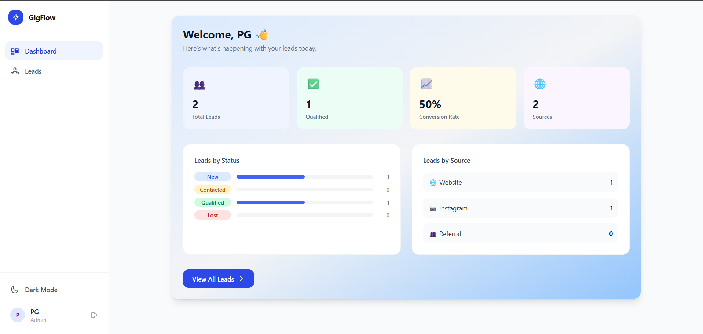
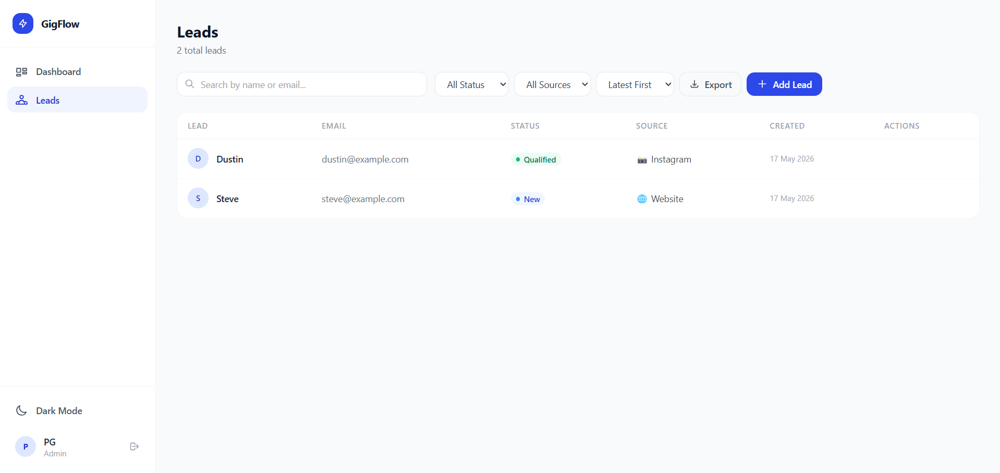
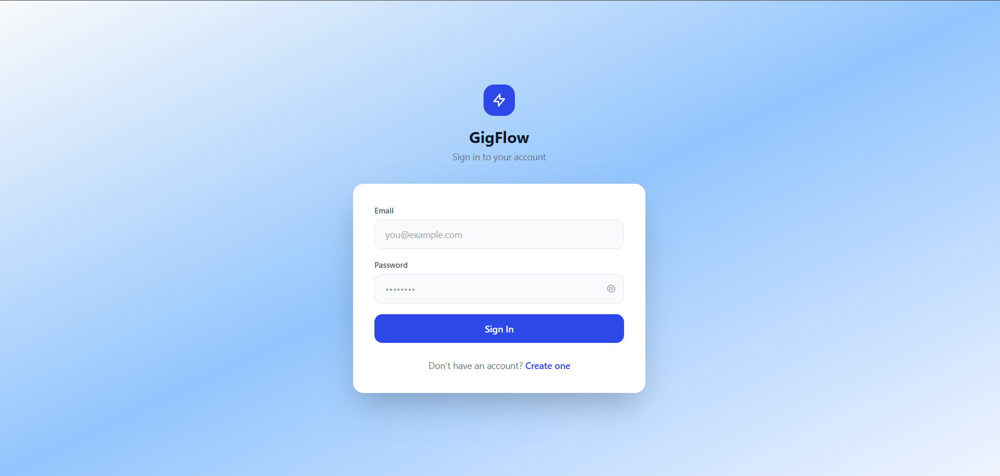

# GigFlow — Smart Leads Dashboard

A full-stack Lead Management Dashboard built with the MERN stack + TypeScript.

## Highlights

- Full-stack production-ready MERN application
- Type-safe architecture using TypeScript
- Responsive and accessible UI
- Clean RESTful API design
- Scalable backend structure
- Professional project organization

## Tech Stack

**Frontend**: React 18, TypeScript, TailwindCSS, Zustand, React Router v6, Axios  
**Backend**: Node.js, Express, TypeScript, MongoDB + Mongoose, JWT  
**DevOps**: Docker, Docker Compose, Nginx

## Features

- **JWT Authentication** — Register/Login with bcrypt password hashing, protected routes, auth middleware
- **Role-Based Access Control** — Admin (full CRUD) and Sales User (read/create/edit) roles
- **Lead Management** — Create, read, update, delete leads with fields: Name, Email, Status, Source, Notes
- **Advanced Filtering** — Filter by Status + Source simultaneously, search by Name or Email, sort Latest/Oldest
- **Debounced Search** — 400ms debounce to reduce API calls while typing
- **Backend Pagination** — 10 records/page with proper skip/limit and pagination metadata in response
- **CSV Export** — Export filtered leads as CSV with one click
- **Dark Mode** — System-preference aware with manual toggle, persisted in localStorage
- **Responsive Design** — Mobile-first with collapsible sidebar on small screens
- **Loading & Error States** — Skeleton loaders, empty states, toast notifications

## Security Features

- JWT-based authentication
- Password hashing using bcrypt
- Protected API routes
- Role-based authorization
- Secure environment variable handling
- CORS protection

## Performance Optimizations

- Debounced search to minimize API requests
- Backend pagination for scalability
- Optimized MongoDB queries
- Lazy UI rendering states
- Responsive mobile-first design

## Screenshots

### Dashboard


### Leads Management


### Login Page


## Future Improvements

- Real-time notifications
- Team collaboration features
- Lead analytics charts
- Email integration
- Activity tracking
- Role permission management
- AI-powered lead scoring

## Live Demo

Frontend: [Live Frontend URL](https://your-frontend.vercel.app)

Backend API: [Live Backend URL](https://your-backend.onrender.com)

## Quick Start

### Prerequisites
- Node.js 18+
- MongoDB (local or Atlas)

### 1. Clone the repo
```bash
git clone https://github.com/YOUR_USERNAME/gigflow.git
cd gigflow
```

### 2. Backend setup
```bash
cd backend
cp .env.example .env
# Edit .env with your MONGO_URI and JWT_SECRET
npm install
npm run dev
```

### 3. Frontend setup
```bash
cd frontend
npm install
npm run dev
```

Visit `http://localhost:5173`

---

## Docker Setup

```bash
# From project root
cp backend/.env.example backend/.env
# Edit .env values

docker-compose up --build
```

Frontend: `http://localhost:5173`  
Backend: `http://localhost:5000`

---

## Deployment

### Frontend Deployment
Deployed on Vercel

### Backend Deployment
Deployed on Render

### Database
MongoDB Atlas

## API Reference

### Auth
| Method | Endpoint | Description | Auth |
|--------|----------|-------------|------|
| POST | `/api/auth/register` | Register new user | Public |
| POST | `/api/auth/login` | Login and get token | Public |
| GET | `/api/auth/me` | Get current user | Protected |

### Leads
| Method | Endpoint | Description | Auth |
|--------|----------|-------------|------|
| GET | `/api/leads` | List leads with filters | Protected |
| GET | `/api/leads/:id` | Get single lead | Protected |
| POST | `/api/leads` | Create lead | Protected |
| PATCH | `/api/leads/:id` | Update lead | Protected |
| DELETE | `/api/leads/:id` | Delete lead | Admin only |
| GET | `/api/leads/export/csv` | Export as CSV | Protected |
| GET | `/api/leads/stats` | Dashboard stats | Protected |

### Query Parameters (GET /api/leads)
| Param | Type | Example |
|-------|------|---------|
| `status` | string | `New`, `Contacted`, `Qualified`, `Lost` |
| `source` | string | `Website`, `Instagram`, `Referral` |
| `search` | string | `rahul` (searches name + email) |
| `sortBy` | string | `createdAt` or `-createdAt` |
| `page` | number | `1` |
| `limit` | number | `10` (max 50) |

### Sample Response (GET /api/leads)
```json
{
  "success": true,
  "data": [...],
  "meta": {
    "total": 45,
    "page": 1,
    "limit": 10,
    "totalPages": 5,
    "hasNextPage": true,
    "hasPrevPage": false
  }
}
```

---

## Project Structure

```
gigflow/
├── backend/
│   ├── src/
│   │   ├── controllers/     # Route handlers
│   │   ├── middleware/      # Auth, error handling, validation
│   │   ├── models/          # Mongoose schemas
│   │   ├── routes/          # Express routers
│   │   ├── types/           # TypeScript interfaces
│   │   └── server.ts        # Entry point
│   ├── Dockerfile
│   └── tsconfig.json
│
├── frontend/
│   ├── src/
│   │   ├── components/
│   │   │   ├── auth/        # ProtectedRoute
│   │   │   ├── layout/      # AppLayout, Sidebar
│   │   │   ├── leads/       # LeadsTable, LeadForm, Filters
│   │   │   └── ui/          # Modal, Pagination, StatusBadge
│   │   ├── hooks/           # useLeads, useDebounce
│   │   ├── pages/           # Dashboard, Leads, Login, Register
│   │   ├── services/        # Axios API wrappers
│   │   ├── store/           # Zustand auth store
│   │   └── types/           # TypeScript types
│   ├── Dockerfile
│   └── nginx.conf
│
└── docker-compose.yml
```

---

## Environment Variables

### Backend (.env)
```
PORT=5000
MONGO_URI=mongodb://localhost:27017/gigflow
JWT_SECRET=your_strong_secret_here
JWT_EXPIRES_IN=7d
NODE_ENV=development
CLIENT_URL=http://localhost:5173
```

### Frontend (.env)
```
VITE_API_URL=http://localhost:5000/api
```

## Author

Pranjal Gupta

- GitHub: https://github.com/YOUR_USERNAME
- LinkedIn: https://linkedin.com/in/YOUR_LINKEDIN

## License

This project was developed as part of an internship assignment.